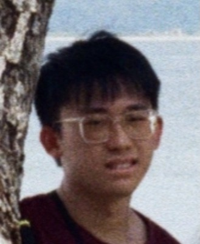
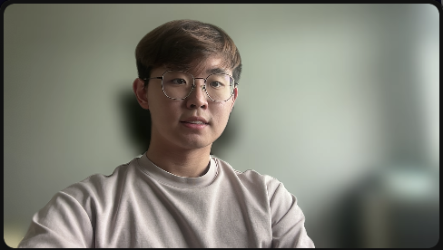
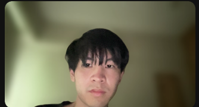

# About Us

We are a team based in the [School of Computing, National University of Singapore](http://www.comp.nus.edu.sg).

## Project team

### Daniel Loh

[[github](https://github.com/dloh2236)]
[[portfolio](team/dloh2236.md)]

* Role: Developer
* Responsibilities: Code writing, debugging.

### Chew Jun Heng

[[github](https://github.com/chew01)]
[[portfolio](team/chew01.md)]

* Role: Developer
* Responsibilities: New features, workflows

### Ito Tetsushi

[[github](http://github.com/sushiayde)]
[[portfolio](team/sushiyade.md)]

* Role: Developer
* Responsibilities: Deadlines + Issue handling

### Nicholas Cher

[[github](http://github.com/nicholascher)]
[[portfolio](team/nicholascher.md)]

* Role: Developer
* Responsibilities : Deliverables and deadlines

### Debbie Hii

[[github](http://github.com/flexibo)]
[[portfolio](team/flexibo.md)]

* Role: Developer
* Responsibilities : Code writing and Design
