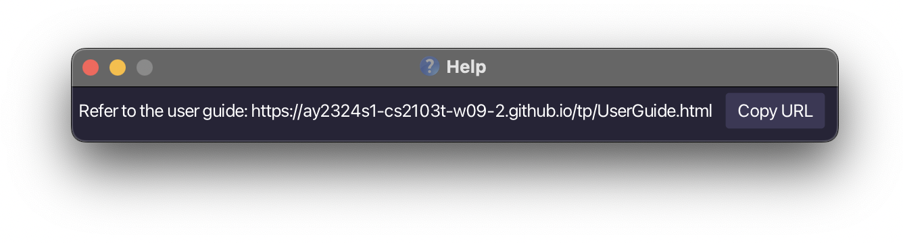

# FreelanceBuddy User Guide

Welcome to the FreelanceBuddy, a **powerful and efficient Command Line Interface (CLI) optimised app designed for passionate freelancers** like you.
It's your one-stop solution for managing multiple clients, tracking project statuses, and staying on top of your financial reports effortlessly.

<!-- * Table of Contents -->
<page-nav-print />

--------------------------------------------------------------------------------------------------------------------

## Quick start

1. Ensure you have Java `11` or above installed in your Computer.

2. Download the latest `FreelanceBuddy.jar` from [here](https://github.com/AY2324S1-CS2103T-W09-2/tp/releases/).

3. Copy the file to the folder you want to use as the _home folder_ for your app.

4. Open a command terminal, `cd` into the folder you put the jar file in, and use the `java -jar FreelanceBuddy.jar` command to run the application. 

   A GUI similar to the below should appear in a few seconds. 

> Note how the app already contains some sample data.

   

5. Upon successful start up you should see 3 tabs:
   * **Contacts** (Landing tab)
     * List of contacts
   * **Finance**
     * List of finances (both commission and expenses)
   * **Events**
       * List of events

6. At the top you should see a command box with the text "_Enter command here..._". This is where you type your commands and press Enter to execute. e.g. typing **`help`** and pressing Enter will open the general help window. 
   Some example commands you can try:

   * `tab finance` : switches tab to the Finance tab.

   * `help` : shows help opens up the general help window. 
   
   * `list` : Lists all relevant information in the respective tabs.

   * `add n/John Doe p/98765432 e/johnd@example.com` : Adds a contact named `John Doe` to the contact list shown in the Contacts Tab with the specified phone number and email address.

   * `delete 3` : Deletes the 3rd contact shown in the current list.

   * `clear` : Deletes all entires in the respective tabs.

   * `exit` : Exits the app.

7. Refer to the [Features](#features) below for details of each command.

--------------------------------------------------------------------------------------------------------------------

## Features

<box type="info" seamless>

**Notes about the command format:** 

* Words in `UPPER_CASE` are the parameters to be supplied by the user. 
  e.g. in `add n/NAME`, `NAME` is a parameter which can be used as `add n/John Doe`.

* Items in square brackets are optional. 
  e.g `n/NAME [t/telegram]` can be used as `n/John Doe t/@johnnyd` or as `n/John Doe`.

* Items with `…`​ after them can be used multiple times including zero times. 
  e.g. `[t/CLIENT]…​` can be used as ` ` (i.e. 0 times), `c/Alex Yeoh`, `c/Alex Yeoh c/Bernice Yu` etc.

* Parameters can be in any order. 
  e.g. if the command specifies `n/NAME p/PHONE_NUMBER`, `p/PHONE_NUMBER n/NAME` is also acceptable.

* Extraneous parameters for commands that do not take in parameters (such as `help`, `list`, `exit` and `clear`) will be ignored. 
  e.g. if the command specifies `help 123`, it will be interpreted as `help`.

* If you are using a PDF version of this document, be careful when copying and pasting commands that span multiple lines as space characters surrounding line-breaks may be omitted when copied over to the application.

</box>

### Viewing help: `help`

Shows a message explaining how to access the help page. This command is available for all tabs, each tab (except the dashboard) will show the help message specifically for the tab itself.

Format: `help`

--------------------------------------------------------------------------------------------------------------------

### Switching tabs → `tab`

Switch views to the specific tab

Format: `tab TAB_NAME`

Acceptable values for `TAB_NAME`:

* `contacts`

* `events`

* `finance`

| #g#Positive Examples## | #r#Negative Examples## | Error Message                                 |
|:----------------------:|:----------------------:|--------------------------------------------------------------------------------------------------------|
|     `tab contacts`     |     `tab contact`      | Unkown parameter Invalid tab name |
|      `tab events`      |         `tab`          | Missing parameter                    |

> **RESULT:** Tab will be switched to Contacts on GUI

--------------------------------------------------------------------------------------------------------------------

### Contact Management

To view contacts tab, either click on the “contacts” button, or use the command tab `contacts` to switch tabs.

#### Listing all contact: Contacts Tab → `list`

Shows a list of all contacts in the **Contacts** tab.

Format: `list`

| #g#Positive Examples## | #r#Negative Examples## | Error Message           |
|:----------------------:|:----------------------:|----------------------------------------------------------------------------------|
|         `list`         |         `lsit`         | Invalid command |

#### Adding a contact: Contacts Tab → `add`

Adds a new contact into the **Contacts** tab.

Format: `add n/NAME p/PHONE_NUMBER e/EMAIL [a/ADDRESS] [c/COMPANY] [t/TELEGRAM_NAME]`

* <code>[a/ADDRESS]</code> should preferably be the company’s address
  <box type="warning" seamless>
    <ul>
        <li>
            Note that each contact can have:
            <ul>
              <li>At most one <code>[a/ADDRESS]</code></li>
              <li>At most one <code>[c/COMPANY]</code></li>
              <li>At most one <code>[t/TELEGRAM_NAME]</code></li>
             </ul>
        </li>
    </ul>
</box>

|     Parameter     | Format                                                                                                         | Examples (#g#Valid##/#r#Invalid##)                                                                   |
|:-----------------:|----------------------------------------------------------------------------------------------------------------|------------------------------------------------------------------------------------------------------|
|      `NAME`       | Text up to 256 characters Must be unique                                                                    | #g#Annie Dunkins## #g#'Chewbaca' The 1st##                                                        |
|  `PHONE_NUMBER`   | Numeric values (optional "+" prefix)                                                                        | #g#81234567## #g#+6581234567## #r#A0u38niufd## #r#(phone number cannot contain alphabets)## |
|      `EMAIL`      | %%\[emailID]@[domainName\]%% [Check email format here](https://www.site24x7.com/tools/email-validator.html) | #g#anniedun.kins@gmail.com## #r#@gmail.com (no email ID)##                                    |
|    `[ADDRESS]`    | Text up to 256 characters                                                                                      | #g#5 Science Park Dr, Singapore 118265##                                                             |
|    `[COMPANY]`    | Text up to 256 characters                                                                                      | #g#Shopee## #g#Sh0p33##                                                                           |
| `[TELEGRAM_NAME]` | Only a-z, 0-9, and underscores allowed                                                                         | #g#destiny_30## #r#destiny.30## #r#(Telegram doesn't accept '.' in their username format)##    |

|                                  #g#Positive Examples##                                  |                                        #r#Negative Examples##                                        | Error Message                                                                  |
|:----------------------------------------------------------------------------------------:|:----------------------------------------------------------------------------------------------------:|-----------------------------------------------------------------------------------------------------------------------------------------|
|                `add n/‘Chewbaca’ The 1st p/+659123139 e/chewie@gmail.com`                |                               `add   p/+659832139 e/chewie@gmail.com`                                | Missing Parameter  Name is missing                                  |
|                 `add n/Annie Dunkins p/+610489630614 e/ann1e@gmail.com`                  |                                                `add`                                                 | Missing Parameter  Name, Phone number, and Email is missing         |
| `add n/Annie Dunkins p/+610489630614 e/ann1e@gmail.com a/Opera house c/NAB t/anniebirds` | `add n/Annie Dunkins p/+610489630614 e/ann1e@gmail.com a/Opera house c/NAB c/Atlassian t/anniebirds` | Excessive number of Parameters  At most one company name is allowed |

> **RESULT:** Contact `{NAME}` added successfully!

#### Finding contact: Contacts Tab → `find`

Shows a list of contacts that contains specific string

Format: `find KEYWORD [MORE_KEYWORDS]...`

<box type="warning" seamless>
* Using partial keywords will be matched. e.g. ha will match hans
> `ha` → 3. Hans Gruber
* The search is case-insensitive. e.g. `hAnS` will match `Hans`
> `hAnS` → 4. Hans Gruber
* Persons matching at least one keyword will be returned (i.e. OR search). e.g. Hans Bo will return Hans Gruber, Bo Yang
> `Hans Bo` → 3. Hans Gruber
>             4. Bo Yang
* The order of the keywords does not matter. e.g. Hans Bo will match Bo Hans
> `Bo Hans` → 3. Hans Gruber
>             4. Bo Yang
* Only the `NAME` of the contact is searched
</box>

| Parameter | Format                    | Examples (#g#Valid##/#r#Invalid##) |
|:---------:|---------------------------|------------------------------------|
| `KEYWORD` | Text up to 256 characters | #g#Hans## #g#3##                |

| #g#Positive Examples## | #r#Negative Examples## | Error Message                                                     |
|:----------------------:|:----------------------:|----------------------------------------------------------------------------------------------------------------------------|
|      `find hans`       |      `find Alex`       | Unknown Entry  No name in contacts with 'Alex'         |
|     `find hAns Bo`     |         `find`         | Missing Parameter  Please add a KEYWORD to search with |

> **RESULT:** Shows names containing given KEYWORD(s) in Contacts tab

#### Deleting a contact with index: Contact Tab → `delete`

Deletes the specified contact from the **Contacts** tab using index.

Format: `delete INDEX`

<box type="warning" seamless>

* Deletes a **contact entry** at specified `INDEX`

* The index refers to the index number shown in the contact `list`
  * `INDEX` will not be accepted if not found within the contact `list`

</box>

| Parameter | Format            | Examples (#g#Valid##/#r#Invalid##)                      |
|:---------:|-------------------|---------------------------------------------------------|
|  `INDEX`  | Positive integers | #g#1## #g#123## #r#-1 (must be positive number)## |

| #g#Positive Examples## |  #r#Negative Examples##   | Error Message                                                                                   |
|:----------------------:|:-------------------------:|----------------------------------------------------------------------------------------------------------------------------------------------------------|
|       `delete 1`       |         `delete`          | Missing Parameter  Name is missing                                                   |
|       `delete 2`       |       `delete 2000`       | Out of Range  Index is out of range, choose an index that is within the contact list |
|       `delete 3`       | `delete -3` `delete 0` | Out of Range  Choose a positive index that is within contact list                    |

> **RESULT:**
> 
> Successful deletion → Deleted Person:`{NAME}`;`{PHONE}`;`{EMAIL}`;`{ADDRESS}`;`{COMPANY}`;`{TELEGRAM_NAME}`
> 
> Unsuccessful deletion → The person index provided is invalid

#### Editing a person : `edit`

Edits an existing person in the address book.

Format: `edit INDEX [n/NAME] [p/PHONE_NUMBER] [e/EMAIL] [a/ADDRESS] [c/COMPANY] [t/TELEGRAM_NAME]`

* Edits the person at the specified `INDEX`. The index refers to the index number shown in the displayed person list. The index **must be a positive integer** 1, 2, 3, …​
* At least one of the optional fields must be provided.
* Existing values will be updated to the input values.
* You can remove optional fields by typing `PREFIX/` without specifying anything after. For example, `t/`.

Examples:

* `edit 1 p/91234567 e/johndoe@example.com` Edits the phone number and email address of the 1st person to be `91234567` and `johndoe@example.com` respectively.
* `edit 2 n/Betsy Crower t/` Edits the name of the 2nd person to be `Betsy Crower` and clears the telegram name.

### Clearing all entries : `clear`

Clears all entries from the address book.

Format: `clear`

--------------------------------------------------------------------------------------------------------------------

### Events Management

To view events tab, either click on the “events” button, or use the command tab `events` to switch tabs.

#### Listing all events: Events Tab → `list`

Shows a list of all events in the **Events** tab.

Format: `list`

| #g#Positive Examples## | #r#Negative Examples## | Error Message           |
|:----------------------:|:----------------------:|----------------------------------------------------------------------------------|
|         `list`         |         `lsit`         | Invalid command |

#### Adding an event: Events Tab → `add`

Adds a new event into the **Events** tab.

Format: `add n/NAME s/TIMESTART e/TIMEEND [c/CLIENT]…​ [l/LOCATION] [d/DESCRIPTION]`

<box type="warning" seamless>
    <ul>
        <li>
            Creates a new event with the specified <code>NAME</code>, <code>TIMESTART</code> and <code>TIMEEND</code>. 
            The <code>NAME</code> refers to the title of the event. 
            The <code>TIMESTART</code> and <code>TIMEEND</code> refer to starting and ending times of the event respectively. 
        </li>
        <li>
            <code>TIMESTART</code> and <code>TIMEEND</code> format should follow the <a href="https://ay2324s1-cs2103t-w09-2.github.io/tp/UserGuide.html#accepted-date-time-formats">Accepted Date-time Formats</a>
        </li>
        <li>
            Note that each contact can have:
            <ul>
              <li>Multiple <code>[c/CLIENT]…​</code> (e.g <code>c/David c/Richard c/Anna</code>) or none</li>
              <li>At most one <code>[l/LOCATION]</code></li>
              <li>At most one <code>[d/DESCRIPTION]</code></li>
             </ul>
        </li>
    </ul>
</box>

|        Parameter        | Format                                      | Examples (#g#Valid##/#r#Invalid##)                                                          |
|:-----------------------:|---------------------------------------------|---------------------------------------------------------------------------------------------|
|         `NAME`          | Text up to 256 characters Must be unique | #g#Annie Dunkins## #g#'Chewbaca' The 1st##                                               |
| `TIMESTART` / `TIMEEND` | DateTime Format  (dd-mm-yyyy HH:mm)      | #g#31-12-2024 21:30## #g#01-09-2023 11:30## #r#1-9-2023 11:30## #r#01092023 1130## |
|       `[CLIENT]`        | Text up to 256 characters                   | #g#Nicholas Cher## #g#Ranchoddas Shamaldas Chanchad##                                    |
|      `[LOCATION]`       | Text up to 256 characters                   | #g#50 Cuscaden Rd, #02-01 Hpl House, Singapore 249724## #g#My House##                    |
|     `[DESCRIPTION]`     | Only a-z, 0-9, and underscores allowed      | #g#Bring notes for Davidson## #g#Concerning new commission##                             |

|                               #g#Positive Examples##                               |                              #r#Negative Examples##                              | Error Message                                                             |
|:----------------------------------------------------------------------------------:|:--------------------------------------------------------------------------------:|------------------------------------------------------------------------------------------------------------------------------------|
|   `add n/Tennis s/31 Sep 23 7:30pm e/9:30pm l/20 Lower Kent Ridge Road, 119080`    | `add‎ ‎s/31-09-2023 19:30 e/31-09-2023 21:30 l/20 Lower Kent Ridge Road, 119080` | Missing Parameter  Name is missing                             |
| `add n/Meetup s/21-02-2023 11:30 e/21-02-2023 14:30 c/Johnny Roger c/David Powell` |           `add n/Meetup s/soon e/today c/Johnny Roger c/David Powell`            | Invalid Format  DateTime Format is incorrect                |
|                          `add n/Gym s/tmr 4pm e/tmr 6pm`                           |                       `add n/Gym s/in 2 hours e/in 1 hour`                       | Illegal Time Sequence  The `TIMEEND` must be after the `TIMESTART` |

> **RESULT:** 
> 
> New event added: `{NAME}`; Start: `{TIMESTART}`; End: `{TIMEEND}`; Clients: `{CLIENTS}…​`; Location: `{LOCATION}`; Description: `{DESCRIPTION}`

#### Deleting an event: Events Tab → delete `delete`

Deletes an existing event from the **Events** tab.

Format: `delete INDEX`

<box type="warning" seamless>
    <ul>
        <li>
            Deletes the event at the specified <code>INDEX</code>.
        </li>
        <li>
            The <code>INDEX</code> must refer to a event found on the Events tab
        </li>
        <li>
            The <code>INDEX</code> must be a positive integer
        </li>
    </ul>
</box>

|    Parameter    | Format                                                         | Examples (#g#Valid##/#r#Invalid##)                                                          |
|:---------------:|----------------------------------------------------------------|---------------------------------------------------------------------------------------------|
|     `INDEX`     | Positive integer within range of indices in Events list listed | Assuming there are 10 entries: #g#2## #g#10## #r#14## #r#-1## #r#2.4##       |

|                #g#Positive Examples##                |                          #r#Negative Examples##                           | Error Message                                                                                        |
|:----------------------------------------------------:|:-------------------------------------------------------------------------:|---------------------------------------------------------------------------------------------------------------------------------------------------------------|
|                      `delete 2`                      |                                `delete -1`                                | Out of Range  -1 is not a valid parameter, as INDEX only takes positive numeric values    |
|                      `delete 4`                      |                               `delete one`                                | Invalid Format  one is not a valid parameter, as INDEX only takes positive numeric values |
|                                                      | `delete 150`  while there are less than 150 entries in the events list | Unknown entry  The given entry must be in the event list                                  |

> **RESULT:** 
> 
> Deleted Event: `{NAME}`; Start: `{TIMESTART}`; End: `{TIMEEND}`; Clients: `{CLIENTS}…​`; Location: `{LOCATION}`; Description: `{DESCRIPTION}`

#### Filtering Events by Clients: Events Tab → `filter-c`

Shows a list of events that contains client's names who matches `KEYWORD`.

Format: `filter-c KEYWORD [MORE_KEYWORDS]...`

<box type="warning" seamless>

* Using partial keywords will be matched. e.g. ha will match clients with hans
> `ha` → 3. Hans Gruber
* The search is case-insensitive. e.g. `hAnS` will match `Hans`
> `hAnS` → 4. Hans Gruber
* Events with any client matching at least one keyword will be returned (i.e. OR search). e.g. Hans Bo will return events containing both Hans Gruber and Bo Yang
> `Hans Bo` → 3. Hans Gruber
>             4. Bo Yang
* The order of the keywords does not matter. e.g. Hans Bo will match Bo Hans
> `Bo Hans` → 3. Hans Gruber
>             4. Bo Yang
* Only the `{CLIENT}…​` in the Event is searched.

</box>

| Parameter | Format                    | Examples (#g#Valid##/#r#Invalid##) |
|:---------:|---------------------------|------------------------------------|
| `KEYWORD` | Text up to 256 characters | #g#Hans## #g#3##                |

| #g#Positive Examples## | #r#Negative Examples## | Error Message                                                     |
|:----------------------:|:----------------------:|----------------------------------------------------------------------------------------------------------------------------|
|    `filter-c hans`     |    `filter-c Allen`    | Unknown Entry  No client in events with name 'Allen'   |
|   `filter-c hAns Bo`   |       `filter-c`       | Missing Parameter  Please add a KEYWORD to search with |

> **RESULT:** Shows Events with tagged Clients containing given KEYWORD(s) in Events tab

--------------------------------------------------------------------------------------------------------------------

### Finance Management

#### Receiving Commission: Finance Tab → `add commission`

Adds a **commission** to the **Finance** tab. The commissions will be sorted in chronological order, 
with the most recent **commission** appearing at the top.

Format: `add commission a/AMOUNT n/CLIENT [d/DESCRIPTION]`

<box type="warning" seamless>
    <ul>
        <li>
            The <code>a/AMOUNT</code> for a commission is to be strictly positive and is a numeric value of up to two decimal places
        </li>
        <li>
            The <code>[d/DESCRIPTION]</code> is optional and can be used to provide details about the commission
        </li>
    </ul>
</box>

|        Parameter        | Format                                     | Examples (#g#Valid##/#r#Invalid##)                                                                                                                                 |
|:-----------------------:|:-------------------------------------------|:-------------------------------------------------------------------------------------------------------------------------------------------------------------------|
|        `AMOUNT`         | Positive numbers up to two decimal points  | #g#5.60## #g#1902.1## #g#56908## #r#$50730 (not a valid number)## #r#-1 or 0(not a positive number)## #r#556.9834 (too many decimal places)##  |
|        `CLIENT`         | Text up to 256 characters                  | #g#Annie Dun## #g#Samuel Dames##                                                                                                                           |
|     `[DESCRIPTION]`     | Text up to 256 characters                  | #g#This is an example eventDescription##                                                                                                                            |

|                     #g#Positive Examples##                     |                                #r#Negative Examples##                                | Error Message                                                                                        |
|:--------------------------------------------------------------:|:------------------------------------------------------------------------------------:|---------------------------------------------------------------------------------------------------------------------------------------------------------------|
| `add commission n/Betsy Crower a/800 d/UI design for NinjaVan` |           `add commission n/Betsy Crower a/$800 d/UI design for NinjaVan`            | Out of Range $800 is not a valid parameter, as AMOUNT only takes positive numeric values  |
|              `add commission n/Steph Evans a/300`              |                            `add commision n/Betsy Crower`                            | Invalid Format  The AMOUNT parameter is mandatory and should not be omitted               |
|                                                                | `add commision a/100 n/Betsy Crower` *(Betsy Crower is not in the contact list)* | Unknown Entry  The given client must be in the contact list                               |

> **RESULT:** Commission from `{Client}` of `{Amount}` added successfully!

#### Deleting a Finance Entry: Finance Tab → `delete`

Deletes the specified **Finance** entry (expense or commission) from the **Finance** tab.

Format: `delete INDEX`

<box type="warning" seamless>
    <ul>
        <li>
            Deletes the finance entry at the specified <code>INDEX</code>
        </li>
        <li>
            The <code>INDEX</code> must refer to an entry found on the Finance tab
        </li>
        <li>
            The <code>INDEX</code> must be a positive integer
        </li>
    </ul>
</box>

| Parameter |                           Format                           |                                                                       Examples (#g#Valid##/#r#Invalid##)                                                                       |
|:---------:|:----------------------------------------------------------:|:------------------------------------------------------------------------------------------------------------------------------------------------------------------------------:|
|  `INDEX`  |  Positive integer within range of indices in finance list  |  Assuming that there are 10 entries #g#2## #g#10## #r#13(not within range of indices)## #r#-1 or 0(not a positive number)## #r#56.9834 (not an integer)##  |

| #g#Positive Examples## |                         #r#Negative Examples##                          | Error Message                                                                                        |
|:----------------------:|:-----------------------------------------------------------------------:|---------------------------------------------------------------------------------------------------------------------------------------------------------------|
|       `delete 2`       |                               `delete -1`                               | Out of Range -1 is not a valid parameter, as INDEX only takes positive numeric values     |
|      `delete 200`      |                              `delete one`                               | Invalid Format  one is not a valid parameter, as INDEX only takes positive numeric values |
|                        | `delete 150` *(There are less than 150 entries in the finance tab)* | Unknown Entry  The given entry must be in the finance list                                |

> **RESULT:** Finance entry at `INDEX` deleted successfully!

--------------------------------------------------------------------------------------------------------------------

### Exiting the program : `exit`

Exits the program.

Format: `exit`

### Saving the data

AddressBook data are saved in the hard disk automatically after any command that changes the data. There is no need to save manually.

### Editing the data file

AddressBook data are saved automatically as a JSON file `[JAR file location]/data/addressbook.json`. Advanced users are welcome to update data directly by editing that data file.

<box type="warning" seamless>

**Caution:**
If your changes to the data file makes its format invalid, AddressBook will discard all data and start with an empty data file at the next run.  Hence, it is recommended to take a backup of the file before editing it.
</box>

<!-- ### Archiving data files `[coming in v2.0]`

_Details coming soon ..._-->

--------------------------------------------------------------------------------------------------------------------

### Accepted Date-time Formats

For the CLI experience to be optimised, FreelanceBuddy accepts a **variety of date-time formats** so that you can type in your date-time inputs **quickly** and **without hassle**.
Pick and choose any of your preferred format at your convenience.

#### Contents of this section:

As this section is relatively long, we have provided a mini table of content for quick navigation.

- [Accepted Numbered Date Formats](#accepted-numbered-date-formats)
- [Accepted Natural Language Date Formats](#accepted-natural-language-date-formats)
- [Accepted Natural Language Time Formats](#accepted-numbered-time-formats)
- [Accepted Natural Language Time Formats](#accepted-natural-language-time-formats)
- [Accepted Natural Language Date and Time Formats](#accepted-natural-language-date-and-time-formats)
- [Using Date and Time Inputs Together](#using-date-and-time-inputs-to-together)
- [Using Date-time Formats for Durations](#using-date-time-formats-for-durations)
- [Using Date-time Formats for Instances](#using-date-time-formats-for-time-instances)

#### Accepted Numbered Date Formats

Below is a table of accepted numbered date formats, these represent `<DATE>` only.

|    Format    | Examples                   | Remarks            |
|:------------:|----------------------------|--------------------|
|  `d/M/yyyy`  | `1/1/2023`, `01/12/2023`   |                    |
|  `d-M-yyyy`  | `1-1-2023`, `01-12-2023`   |                    |
|   `d/M/yy`   | `1/1/23`, `01/12/12`       |                    |
|   `d-M-yy`   | `1-1-23`, `01-12-12`       |                    |
| `MMM d yyyy` | `Jan 1 2023`, `jan 1 2023` | Not case sensitive |
|  `MMM d yy`  | `Jan 1 23`, `jan 1 23`     | Not case sensitive |
| `d MMM yyyy` | `1 Jan 2023`, `1 jan 2023` | Not case sensitive |
|  `d MMM yy`  | `Jan 1 2023`, `1 jan 23`   | Not case sensitive |
|  `yyyy/M/d`  | `2023/1/1`, `2023/12/01`   |                    |
|   `yy/M/d`   | `23/1/1`, `23/12/01`       |                    |
|  `yyyy-M-d`  | `2023-1-1`, `2023-12-01`   |                    |
|   `yy-M-d`   | `23-1-1`, `23-12-01`       |                    |
|    `d/M`     | `1/1`, `01/12`             |                    |
|    `d-M`     | `1-1`, `01-12`             |                    |
|   `MMM d`    | `Jan 1`, `jan 1`           | Not case sensitive |
|   `d MMM`    | `1 Jan`, `jan 1`           | Not case sensitive |

> 🏷 ****TO NOTE**** inputs without year will be assumed to be the current year.

[Back to Date-time Contents](#contents-of-this-section)

#### Accepted Natural Language Date Formats

Below is a table of accepted natural language date formats, these represent `<DATE>` only.

> **Note:** all inputs are not case-sensitive.

|               Format                | Examples                      | Remarks                                                                                                     |
|:-----------------------------------:|-------------------------------|-------------------------------------------------------------------------------------------------------------|
|          `today` `tdy`          | -                             | Date of the current date                                                                                    |
|        `tomorrow` `tmr`         | -                             | Date of the next day with reference to current date                                                         |
|        `yesterday` `ytd`        | -                             | Date of the previous day with reference to current date                                                     |
|    `next <day/week/month/year>`     | `next day`                    | Date of the next specified timeframe with reference to current date                                         |
|         `next <DayOfWeek>`          | `next Mon`, `next Sunday` | Date of the next occurrence of the day of week specified Day of the week can be short-form (3 letters). |
| `in <number> <day/week/month/year>` | `in 5 days`, `in 1 week`  | Date of next specified timeframe with reference to current date                                             |

[Back to Date-time Contents](#contents-of-this-section)

#### Accepted Numbered Time Formats

Below is a table of accepted numbered time formats, these represent `<TIME>` only.

> 🏷 ****TO NOTE**** all inputs are not case-sensitive.

|  Format  | Examples             | Remarks            |
|:--------:|----------------------|--------------------|
|  `HHmm`  | `1800`, `0600`       |                    |
| `HH:mm`  | `18:00`, `06:00`     |                    |
| `HH.mm`  | `18.00`, `06.00`     |                    |
|  `h a`   | `6 pm`, `6 PM`       |                    |
|   `ha`   | `6pm`, `6PM`         |                    |
| `h:mm a` | `6:00 PM`, `6:00 am` | Not case sensitive |
| `h:mma`  | `6:00pm`, `6:00AM`   | Not case sensitive |
| `h.mm a` | `6.00 pm`, `6.00 AM` | Not case sensitive |
| `h.mma`  | `6.00PM`, `6.00am`   | Not case sensitive |

[Back to Date-time Contents](#contents-of-this-section)

#### Accepted Natural Language Time Formats

Below is a table of accepted natural language time formats, these represent `<TIME>` only.

|   Format   | Examples | Remarks |
|:----------:|----------|---------|
|   `noon`   | -        | 12:00   |
| `midnight` | -        | 00:00   |

[Back to Date-time Contents](#contents-of-this-section)

#### Accepted Natural Language Date and Time Formats

Below is a table of accepted natural language time formats, these represent **`<DATE>` AND `<TIME>`**!

> **Note for all inputs,**
> * they are not case-sensitive
> * they represent both a date and time

|             Format              | Examples                              | Remarks                                                                    |
|:-------------------------------:|---------------------------------------|----------------------------------------------------------------------------|
|              `now`              | -                                     | Date and time of instance that the command runs                            |
| `<number> <time_unit> from now` | `2 days from now` `1 hr from now` | Date and time from the specified timeframe of the instant the command runs |
|   `in <number> <hour/minute>`   | `in 30 mins` `in 1 hour`          | Date and time from the specified timeframe of the instant the command runs |

[Back to Date-time Contents](#contents-of-this-section)

#### Using Date and Time Inputs to Together

In most cases, you may use date-only or time-only inputs, otherwise you may wish to combine the two.

A `<DATE> <TIME>` combination can be acheived in the following ways:

| Method                                                        |                                 Example                                 |
|---------------------------------------------------------------|:-----------------------------------------------------------------------:|
| Using  `<DATE> <TIME>` inputs                                 |              `now` `5 mins from now` `in 2 hours`               |
| Combining any valid `<DATE>` and `<TIME>` inputs together | `1-1-23 18:00` `1 Jan 23 18:00` `tmr 6pm` `next Sunday 6pm` |

> 🏷 ****TO NOTE**** `<DATE>` must **always** come before `<TIME>`

[Back to Date-time Contents](#contents-of-this-section)

#### Using Date-time Formats for Durations

Relevant for:
1. Creating Events `s/TIMESTART` and `e/TIMEEND` parameters.
2. `filter-t` method in Finance to get Finance record within specified timeframe.

<box type="info" seamless>

🏷 ****TO NOTE**** 

There are several **rules** and [**assumptions**](#assumptions-using-date-time-combinations) that FreelanceBuddy date time reader makes use of that would be useful to understand to optimise your user experience.

</box>

##### Accepted Date-time Combinations of `s/` and `e/`

> `<DATE>` and `<TIME>` placeholder represents the `<DATE>` and `<TIME>` formats that are shown above.

|      `s/`       |      `e/`       |
|:---------------:|:---------------:|
| `<DATE> <TIME>` | `<DATE> <TIME>` |
| `<DATE> <TIME>` |    `<TIME>`     |
|    `<DATE>`     |    `<DATE>`     |
|    `<TIME>`     |    `<TIME>`     |
|    `<TIME>`     | `<DATE> <TIME>` |
| `<DATE> <TIME>` |    `<DATE>`     |
|    `<DATE>`     | `<DATE> <TIME>` |

> Beginner In general, just use a `s/` and `e/` combination that makes sense to you. A format that will always work is to state your date and times explicitly such as, `1 Jan 2023 17:00`.

**General Rules**:

1. You cannot start from a `<DATE>` to `<TIME>` or vice versa.
1. Following the assumptions, `e/` cannnot be earlier than `s/`.

##### Assumptions when using Date-time Combinations

FreelanceBuddy streamlines the input process for the `s/` and `e/` parameters. 

For instance, in the case of same-day events, you'll only need to provide a date in the `s/` input field.
FreelanceBuddy will intelligently use this date as both the start and end date, _eliminating the need for redundant input_ in the `e/` field.

This feature hopes to **enhance efficiency** and **simplify the event creation** process, creating a more **user-friendly** experience for you.

Here is a list of all Date-time Combination Assumptions:

|           Input            | Assumptions                                                                                                                                                                                                                                                                                                              |
|:--------------------------:|--------------------------------------------------------------------------------------------------------------------------------------------------------------------------------------------------------------------------------------------------------------------------------------------------------------------------|
| `s/<DATE> <TIME> e/<TIME>` | End date will be taken from the start date input. Start time must be before end time. **Example**: `s/tmr 6pm e/8pm` sets the event for tomorrow, 6-8pm.                                                                                                                                                             |
|    `s/<DATE> e/<DATE>`     | Time of start date will be set to 00:00, while end date will be set to 23:59. **Example**: `s/1 Jan 23 e/1 Jan 23` sets the event from 1st Jan 2023, 12am to 11:59pm                                                                                                                                                 |
|    `s/<TIME> e/<TIME>`     | Date of both start and end time will be set to the next occurrence of such a duration. **Example**: (Assume current time is 12pm) `s/9am e/10am` sets the event date to the next day as this duration has passed. `s/10am e/5pm` sets the event date to the current day as this duration has not yet passed. |
| `s/<TIME> e/<DATE> <TIME>` | Start date will be set to the date of the next occurrence of the specified time. **Example**: (Assume current time is 12pm) `s/9am e/tmr 10am` sets the event for tomorrow, 9-10am. `s/5pm e/tmr 5am` sets the event from today, 5pm to tomorrow 5am.                                                        |
| `s/<DATE> <TIME> e/<DATE>` | End date time will be set to 23:59. **Example**: `s/1 Jan 2023 9am e/1 Jan` sets the event for 1st Jan 2023, 9am to 11:59pm.                                                                                                                                                                                         |
| `s/<DATE> e/<DATE> <TIME>` | Start date time will be set to 00:00. **Example**: `s/1 Jan 2023 e/ 1 Jan 2023 5pm` sets the event for 1st Jan 2023, 12am to 5pm.                                                                                                                                                                                    |

[Back to Date-time Contents](#contents-of-this-section)

#### Using Date-time Formats for Time Instances

Relevant for:
1. Creating Finance entries with a specified time in the `t/TIMEDUE` parameter 
2. `filter-t` method in Events to get relevant Events that are from now to the specified time.

You might want to consider the assumptions made for either `<DATE>` or `<TIME>` if either is left blank.

##### Assumptions when using Date-time Instance

|      Input      | Assumptions                                      |
|:---------------:|--------------------------------------------------|
| `<DATE> <TIME>` | As specified                                     |
|    `<DATE>`     | Time is set to 12am of the specified date        |
|    `<TIME>`     | Date is set to next occurrence of specified time |

[Back to Date-time Contents](#contents-of-this-section)

--------------------------------------------------------------------------------------------------------------------

## FAQ

**Q**: How do I transfer my data to another Computer? 
**A**: Install the app in the other computer and overwrite the empty data file it creates with the file that contains the data of your previous FreelanceBuddy home folder.

--------------------------------------------------------------------------------------------------------------------

## Known issues

1. **When using multiple screens**, if you move the application to a secondary screen, and later switch to using only the primary screen, the GUI will open off-screen. The remedy is to delete the `preferences.json` file created by the application before running the application again.

--------------------------------------------------------------------------------------------------------------------

## Command summary

### General 
Commands that applies to ALL tabs

| Action   | Format, Examples                         |
|----------|------------------------------------------|
| **Tab**  | `tab TAB_NAME`   e.g., `tab contacts` |
| **List** | `list`                                   |
| **Help** | `help`                                   |

### Contacts Tab

| Action                      | Format, Examples                                                                                                                                    |
|-----------------------------|-----------------------------------------------------------------------------------------------------------------------------------------------------|
| **Add**                     | `add n/NAME p/PHONE_NUMBER e/EMAIL [a/ADDRESS] [c/COMPANY] [t/TELEGRAM_NAME]`   e.g., `add n/‘Chewbaca’ The 1st p/+659123139 e/chewie@gmail.com` |
| **Find**                    | `find KEYWORD [MORE_KEYWORDS]…​`   e.g., `find Annie Bob`                                                                                        |
| **Delete using index(es)**  | `delete INDEX [MORE_INDEX]…​`   e.g., `delete 1 2 3`                                                                                             |
| **Delete using keyword(s)** | `delete KEYWORD [MORE_KEYWORDS]…​`  e.g., `delete hAns Bo`                                                                                       |

### Events Tab

| Action     | Format, Examples                                                                                                                                                                  |
|------------|-----------------------------------------------------------------------------------------------------------------------------------------------------------------------------------|
| **Add**    | `add n/NAME s/TIMESTART e/TIMEEND [c/CLIENT] [l/LOCATION] [d/DESCRIPTION]`   e.g., `add event Tennis s/31-09-2023 19:30 e/31-09-2023 21:30 l/20 Lower Kent Ridge Road, 119080` |
| **Delete** | `delete INDEX`  e.g., `delete 3`                                                                                                                                               |

### Finance Tab

| Action     | Format, Examples                                                                                                               |
|------------|--------------------------------------------------------------------------------------------------------------------------------|
| **Add**    | `add commission a/AMOUNT n/CLIENT [d/DESCRIPTION]`   e.g., `add commission n/Betsy Crower a/800 d/UI design for NinjaVan`   |
| **Delete** | `delete INDEX`  e.g., `delete 3`                                                                                            |
